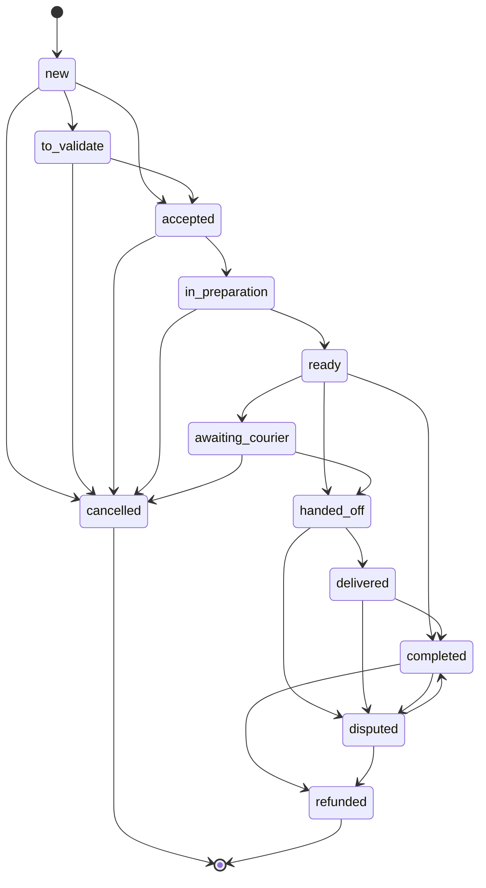
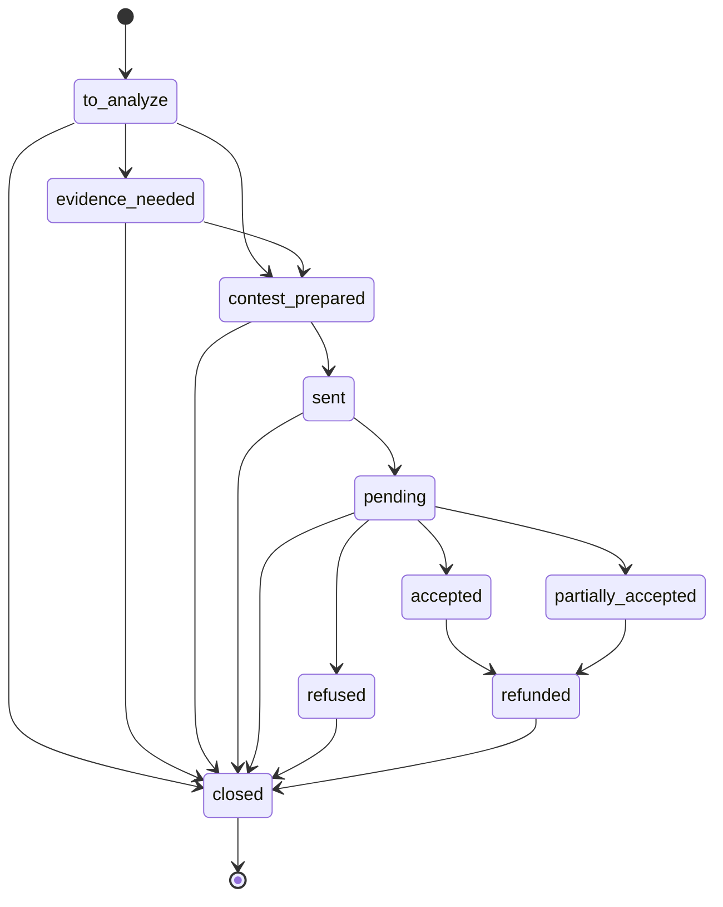

# Règles métier — noveresto-saas

> Recensement des règles métier réellement appliquées dans le code
> (`services/*.js`, middlewares, routes), pas des intentions. Chaque règle
> renvoie au fichier qui l'implémente. À lire avec `docs/MODULES.md`
> (ce que fait chaque module) et `docs/DECISIONS.md` (pourquoi).

## Sommaire

1. [Règles transverses — accès et sécurité](#1-règles-transverses--accès-et-sécurité)
2. [Commandes](#2-commandes)
3. [Coûts et marges](#3-coûts-et-marges)
4. [Stocks et achats](#4-stocks-et-achats)
5. [Inventaire](#5-inventaire)
6. [Suggestions d'achat](#6-suggestions-dachat)
7. [Prévisions d'ingrédients](#7-prévisions-dingrédients)
8. [Finance et TVA](#8-finance-et-tva)
9. [Litiges](#9-litiges)
10. [Copilote IA](#10-copilote-ia)
11. [Prospection](#11-prospection)
12. [Réputation](#12-réputation)
13. [Facturation TEIF](#13-facturation-teif)
14. [Points de vigilance](#14-points-de-vigilance)

---

## 1. Règles transverses — accès et sécurité

**Convention de tenant** : `restaurant_id` = `users.id`. Il n'existe pas de
table `restaurants`.

**Trois profils d'accès** (`middleware/restaurant-scope-middleware.js`) :

- `admin` — accès à tous les restaurants.
- `franchise_owner` — accès uniquement aux restaurants de **son**
  organisation. L'appartenance est **revérifiée en base à chaque requête**
  (jamais depuis le seul JWT), avec trois conditions cumulatives : même
  `organization_id`, `organization_id` NON NULL, et cible de rôle `client`.
- `client` — verrouillé sur son propre compte : tout `restaurant_id` fourni
  dans la requête est **ignoré** (protection IDOR).

**Permissions par module** (`middleware/module-access-middleware.js`,
`services/module-access-service.js`) :

- Règle : la présence d'une ligne `(user_id, module_key)` dans
  `module_access` = accès autorisé.
- L'`admin` contourne toujours la vérification.
- Vérification appliquée **route par route**, jamais en `router.use()` global
  (cf. `docs/DECISIONS.md`).
- `setUserModules` **efface puis réécrit la liste complète** des modules d'un
  compte : un module non recoché disparaît silencieusement.
- Modules valides : `overview`, `orders`, `kds`, `menus`, `recipes`,
  `stocks`, `purchases`, `staff`, `disputes`, `finance`, `copilot`,
  `prospection`.

**Authentification** (`server.js`) :

- JWT valable 7 jours.
- Le serveur **refuse de démarrer** (`process.exit(1)`) si `JWT_SECRET` est
  absent ou fait moins de 32 caractères.

**Limites de débit** :

- Connexion : 10 tentatives / 15 min (`server.js`).
- Copilote : 10 questions / min + **500 caractères max** par question
  (`restaurant-copilot-routes.js`).
- Diagnostic public : 5 / heure (`public-diagnostic-routes.js`).

---

## 2. Commandes

Fichier : `services/orders-service.js`.

**Machine à 12 statuts** avec transitions strictes — toute transition non
déclarée est rejetée en **HTTP 409** :



`cancelled` et `refunded` sont terminaux (aucune sortie).

**Autres règles** :

- À la création, le montant brut est recalculé côté serveur
  (`Σ unit_price × quantity`).
- Le **taux de TVA de chaque ligne est figé** (snapshot depuis
  `menu_items.vat_rate`) au moment de la commande — l'historique reste exact
  si le taux change ensuite.
- Le passage au statut **`completed` déclenche la déduction de stock**
  (`deductStockForOrder`), en *best-effort* : un échec ne fait jamais échouer
  la mise à jour de la commande.
- Les statuts `cancelled`, `refunded`, `disputed` sont journalisés dans
  l'audit.
- Changement de statut protégé par verrou `SELECT … FOR UPDATE`.
- **File cuisine (KDS)** : n'affiche que `accepted`, `in_preparation`,
  `ready` ; triée retards d'abord (`is_late` = `now > promised_at`).

---

## 3. Coûts et marges

Fichier : `services/costing-service.js`.

- `coût matière = Σ (recipe_ingredients.quantity × ingredients.unit_cost)`
- `food_cost_pct = coût_matière / prix × 100`
- `marge_unitaire = prix − coût_matière`
- `marge_pct = marge_unitaire / prix × 100`
- Garde-fou : si `prix = 0`, les pourcentages retournent 0.

---

## 4. Stocks et achats

Fichier : `services/stock-service.js`.

- **Déduction sur commande** : par ingrédient,
  `quantité_consommée = recipe_ingredients.quantity × quantité_commandée` ;
  mouvement `consumption` (quantité négative). Best-effort (voir §2).
- **Réception d'un bon d'achat** : incrémente `current_stock`, **met à jour
  `unit_cost` avec le dernier prix payé**, refuse une double réception
  (**409** si déjà `received`). Transactionnel ; mouvement `purchase_receipt`.
- **Ajustement manuel** : mouvement `correction` (type par défaut),
  `reference_type = 'manual'`.

---

## 5. Inventaire

Fichier : `services/inventory-service.js`.

- **Le comptage physique fait foi.**
- `variance = quantité_comptée − stock_théorique`
- `variance_value = variance × unit_cost`
- Après comptage, `current_stock` est **resynchronisé sur la quantité
  comptée** et un mouvement `correction` (référence `inventory_count`) est
  tracé. Transactionnel (`SELECT … FOR UPDATE`).
- Le résumé d'écarts agrège par ingrédient, **trié par valeur perdue** (plus
  grosses pertes en tête) ; `total_loss_value` ne somme que les variances
  négatives.

---

## 6. Suggestions d'achat

Fichier : `services/purchase-suggestion-service.js`.

**Formule** :

```
quantité = besoin_prévisionnel(sur lead_time_days)
         + min_stock            (stock de sécurité)
         − current_stock
         − commandes_en_cours   (purchase_orders en statut 'draft' ou 'sent')
```

Bornée à zéro (`Math.max(0, …)`).

**Règles** :

- Ne concerne que les ingrédients `auto_suggest_enabled = true`.
- Le système **ne crée jamais de bon d'achat automatiquement** : la
  suggestion est en statut `pending`, **validation humaine obligatoire**.
- **Une seule suggestion `pending` par ingrédient et par jour** (anti-doublon
  si le job cron tourne deux fois).
- La validation crée un bon d'achat `draft` + sa ligne, à l'`unit_cost`
  courant ; la quantité peut être ajustée à la validation.
- Job cron : `jobs/run-daily-purchase-suggestions.js` (recommandé `0 6 * * *`).

---

## 7. Prévisions d'ingrédients

Fichier : `services/forecast-service.js` — méthode `ratio_v1` (MVP).

Décompose le CA global prévu par Prophet (`ml_forecasts`) en besoin par
ingrédient à partir de l'historique réel des ventes :

```
facteur(date)          = revenue_prévu(date) / CA_moyen_quotidien
qté_prévue_article     = moyenne_historique_quotidienne_article × facteur
besoin_ingrédient(date) = Σ qté_prévue_article × recipe_ingredients.quantity
```

- Fenêtre d'historique : **30 jours** (`LOOKBACK_DAYS`).
- Renvoie un **avertissement** (pas de chiffre inventé) si l'historique de
  ventes ou les prévisions Prophet sont insuffisants.
- Persistance idempotente : `ON CONFLICT (restaurant_id, ingredient_id,
  forecast_date, method)`.

---

## 8. Finance et TVA

Fichier : `services/finance-service.js`.

- **Hypothèse assumée** : les prix (`order_items.unit_price`) sont **TTC**.
  - `HT = TTC / (1 + taux/100)`
  - `TVA = TTC − HT`
- Les lignes/commandes annulées (`is_cancelled = true`, `status = 'cancelled'`)
  sont **exclues** des ventilations.
- Export CSV : **BOM UTF-8** (compatibilité Excel), montants à 3 décimales.

---

## 9. Litiges

Fichier : `services/disputes-service.js`.

**Machine à 10 statuts** avec transitions strictes (409 sinon) :



**Autres règles** :

- `amount_refunded` n'est enregistré qu'au passage en `refunded`.
- **Écart non récupéré** = `Σ (amount_requested − amount_refunded)` sur les
  litiges `refunded`/`closed`.
- Chaque changement de statut est journalisé dans l'audit.

---

## 10. Copilote IA

Fichier : `services/copilot-service.js`.

**Recommandations = règles déterministes** (aucun appel Claude, gratuites) :

- **Stock faible** : `current_stock ≤ min_stock` et `min_stock > 0`.
- **Marge faible** : article dont la marge est **< 40 %**.
- **Litiges ouverts** : nombre de litiges ouverts > 0.
- **Baisse de CA** : CA du jour **< 50 %** du CA d'hier (et CA d'hier > 0).

Chaque recommandation suit le format : constat, données, impact, action,
confiance.

**Conversation libre** (`askCopilot`) = appel Claude, avec garde-fous stricts
dans le prompt système :

- Répondre **uniquement à partir des données réelles** fournies ; ne jamais
  inventer de chiffre ; dire clairement quand l'information est absente.
- **Ne jamais exécuter d'action sensible** (remboursement, suppression,
  modification de prix) — informe et conseille, n'agit pas.
- Réponse en français, texte simple sans Markdown, 3–5 phrases.

---

## 11. Prospection

Fichier : `services/prospection-service.js`.

**Scoring d'opportunité** (`computeOpportunityTier`) :

| Site web | Nombre d'avis | Palier |
|---|---|---|
| Non | < 20 | `invisible` |
| Non | ≥ 20 | `presence_faible` |
| Oui | < 20 | `presence_faible` |
| Oui | ≥ 20 | `etabli` |

**Autres règles** :

- **20 résultats max** par recherche (coût API Google Places).
- Déduplication par `UNIQUE(restaurant_id, google_place_id)` (upsert).
- Tri de la liste : `invisible` → `presence_faible` → `etabli`, puis nombre
  d'avis croissant (cibles les plus faibles d'abord).
- WhatsApp : lien `wa.me` pré-rempli cliqué manuellement, pas d'API
  automatisée (cf. `docs/DECISIONS.md`).

---

## 12. Réputation

Fichier : `reputation-routes.js`.

**Niveau d'urgence d'un avis** (`detectUrgency`) :

- `critical` si le texte contient un mot-clé sensible
  (`remboursement`, `intoxication`, `malade`, `urgent`, `scandaleux`,
  `avocat`, `plainte`, `jamais`) **OU** note ≤ 2.
- `medium` si note = 3.
- `low` sinon.

**Règle de sécurité** : pour tout avis **critique** (`urgency = 'critical'`
ou note ≤ 2), la réponse générée par l'IA est renvoyée avec
`requires_validation: true` — **validation humaine obligatoire avant envoi**.

**Sources** : Google en live, Facebook en live si configuré (sinon démo),
Uber Eats / Deliveroo / Glovo / Jumia toujours en démo.

---

## 13. Facturation TEIF

Fichier : `services/teif-service.js`.

- **Champs obligatoires** (sinon 400) : matricule fiscal du restaurant,
  matricule fiscal du client, nom du client (scénario B2B).
- Les lignes annulées sont exclues ; refus si aucune ligne active (400).
- Taux de TVA par défaut : **19 %** ; `HT = TTC / (1 + taux/100)`.
- **Une seule facture par commande** : 409 si elle existe déjà
  (`UNIQUE(restaurant_id, order_id)`).
- Numéro de facture : `NR-{restaurant_id}-{order_id}-{timestamp}` ;
  devise `TND` ; type de document `380` (facture commerciale).
- Le module **génère seulement le XML** : pas de signature ni de soumission
  TTN — le statut reste `generated` (cf. `docs/MODULES.md`).

---

## 14. Points de vigilance

- **Best-effort silencieux** : la déduction de stock (§2/§4) et l'écriture
  d'audit ne bloquent pas l'opération principale, mais peuvent donc échouer
  sans erreur visible côté client. À surveiller via les logs.
- **Hypothèse fiscale « prix = TTC »** (§8, §13) non encore validée par un
  professionnel — elle conditionne tous les calculs HT/TVA.
- **`setUserModules` réécrit toute la liste** (§1) : risque de retrait
  involontaire d'un module lors d'une modification d'accès.
